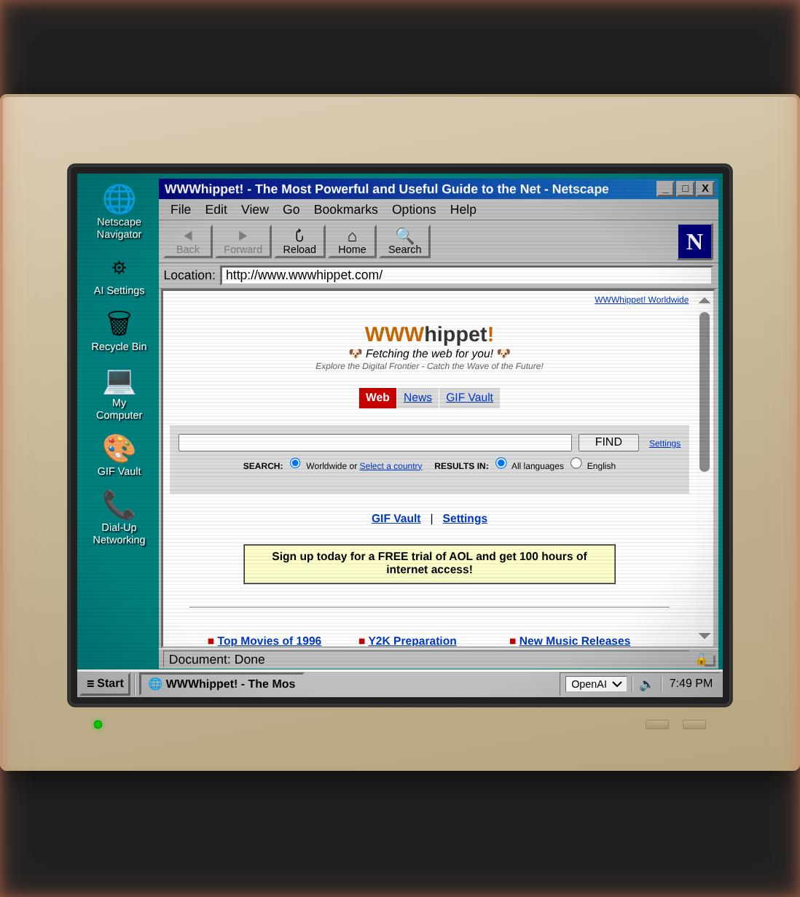

# WWWhippet!

**An AI-powered time machine to the 1990s internet.**

Type any URL. Get a fully-generated, gloriously authentic mid-90s webpage — complete with `<marquee>` tags, visitor counters, "Under Construction" GIFs, and Comic Sans. Every page is unique, interconnected, and dripping with the unmistakable charm of the early web.




## What is this?

WWWhippet simulates the entire experience of browsing the internet in the late '90s. It's not just a CSS skin or a retro theme — it's a **living, breathing fake internet** generated on the fly by AI.

- **A full desktop environment** — CRT monitor, scanlines, taskbar, Start button, draggable windows
- **Whippet Browser** — Netscape Navigator-style interface with address bar, throbber, the works
- **A search engine** — type a query, get a page of AI-generated 90s search results
- **Click any link** — every link leads to another freshly-generated page, building an entire interconnected web as you browse
- **Dial-up networking** — with authentic modem sounds (optional Ollama integration actually loads/unloads models on "connect" and "disconnect")
- **Page types** — personal homepages, fan sites, university pages, corporate sites, news portals — each with era-appropriate layouts, content, and personality
- **mIRC client** — live AI-powered IRC with warez channels, XDCC file downloads, and unforgettable regulars
- **MIDI player** — Windows Media Player 6.4-style MIDI playback with real Web Audio synthesis
- **GIF Vault** — browse and search real animated GIFs from the 90s web
- **ICQ** — AI-powered instant messaging with three friends from school, each with distinct personalities and era-authentic chat
- **DOOM 95** — a playable Wolfenstein-style raycaster with textured walls, sprite enemies, shooting, and a Doom-face HUD
- **Settings panel** — swap AI providers, pick a desktop wallpaper (tiled patterns, clouds, Plus! themes)

## The Experience

1. Double-click Whippet Browser
2. Hear the modem screech (if you dare)
3. Type `www.anything-you-want.com` in the address bar
4. Watch the throbber spin as AI generates a pixel-perfect 90s webpage
5. Click links. Fall down rabbit holes. Discover someone's Buffy fan shrine. Read a university research page about Java applets. Visit a GeoCities neighbourhood.
6. Open mIRC. Join `#warez`. Try to download a movie. Get kicked by Kane.
7. Open ICQ. Chat with your mates. Get your spelling corrected by Phweak.
8. Launch DOOM 95. Clear the level. Die repeatedly.
9. Lose an hour. No regrets.

Every page is built with **real 90s HTML** — `<table>` layouts, `<font>` tags, `bgcolor` attributes, `<marquee>`, `<blink>`, nested tables within tables within tables. No CSS. No divs. Just like the creator of the original page intended.

## Quick Start

```bash
# Clone and install
git clone https://github.com/Robindfuller/snazzy-wwwhippet.git
cd snazzy-wwwhippet
npm install

# Configure your AI provider
cp .env.example .env   # then add your API key(s)

# Launch
npm start
```

Open `http://localhost:3000` and start browsing.

## mIRC Client

Double-click the mIRC icon on the desktop to open a fully simulated IRC client. You connect to a late-1999 warez server with three channels:

| Channel | Scene |
|---------|-------|
| `#warez` | Software, games, keygens, serials |
| `#mp3z` | MP3 albums and singles |
| `#moviez` | DivX AVI and VCD rips |

### The Regulars

Every channel has AI-driven personalities that respond dynamically to whatever you type.

**Kane** `@` — Channel op since 1994. Terse, lowercase, zero patience. Will warn you once. Will kick you on principle. Treats his op status as a religion.

**Phweak!** — Wannabe hacker, full-time Kane fanboy. Drops 2600 references. Piles on whoever Kane is annoyed with. Loves you if Kane loves you; hates you if Kane hates you.

**eggnog123** — Genuinely nice, absolutely clueless. Asks what's already in the topic. Doesn't know what XDCC is. Apologizes profusely. Repeats the exact same mistake 30 seconds later.

Each channel also has background regulars: codec zealots, serial-number experts, audiophiles who will explain why 128kbps is an insult to music.

### XDCC Downloads

Type `/msg xdcc_bot !list` (or `!get N` for a specific pack) to initiate a file transfer. Each channel has its own bot:

- **xdcc_bot** — Warez: Half-Life, Counter-Strike beta, Photoshop 5, Quake 2, WinAmp, ICQ
- **xdcc_bot2** — MP3z: Nirvana, Eminem, Spice Girls, Radiohead, Backstreet Boys, The Prodigy
- **xdcc_bot3** — Moviez: The Matrix, Fight Club, Star Wars SE, Titanic, Saving Private Ryan (CAM rips and VCDs)

Files download into **My Computer** and persist between sessions.

### My Computer

Downloaded files appear in a Windows Explorer-style file manager. Double-click anything to open it — and experience the authentic 1999 codec nightmare:

- **.avi files** — "Missing codec: DIVX (DivX MPEG-4 Video Codec v3.11alpha). Please visit www.divx.com"
- **.mpg files** — "VCD MPEG-1 decoder not found. The file may also be incomplete — downloaded 621 MB of expected 654 MB"
- **.mp3 files** — WinAmp in_mp3.dll error: frame sync header is missing or corrupt. Expected 4,408,320 bytes; got 1,835,008 bytes
- **.zip files** — WinZip CRC Error: Bad CRC, the file may be incomplete
- **.exe files** — "This program has performed an illegal operation and will be shut down"

MIDI files are the one exception — they actually play (see below).

## ICQ

Double-click the ICQ icon to open a classic ICQ 99-style instant messenger. You're logged in as one of three friends from school — all 17, all geeky, all very 1996.

### The Friends

**Phweak!** — Impatient, sharp, keeps his cards close to his chest. Corrects eggnog's spelling. Knows about WinMX before anyone else. Will never start a conversation... unless you mention a Win98 beta CD, in which case he'll casually invite himself round.

**Incon** — Quiet, witty, dry. Rarely starts conversations. Gets on well with Phweak — they talk graphics cards and Quake. The one who silently judges your taste in music.

**eggnog123** — Enthusiastic, friendly, terrible speller. Says "definately" and "wierd" without irony. Talks to everyone about MIDI files and Star Trek desktop themes. The only one who messages first.

All conversations are AI-driven with era-appropriate topics, typing delays proportional to message length, and no emojis (it's 1996).

## DOOM 95

Double-click the skull icon to launch a Wolfenstein 3D-style first-person shooter running entirely in the browser.

- **Raycaster engine** — DDA-based wall casting at 320x200, pixel-rendered to an ImageData buffer
- **Procedural textures** — four 64x64 wall textures (stone, brick, blue tech, wood) generated at startup
- **Enemies** — six sprite-based guards with chase AI and attack mechanics
- **Combat** — click to shoot, with hit detection and weapon animation
- **HUD** — health bar, ammo counter, and a Doom-style face that reacts to damage
- **Controls** — WASD/arrows to move, mouse to shoot

## MIDI Player

Pages can embed MIDI music, and there's a dedicated **MIDI Farm** browser (`midi.html`) for the full library. Playback uses a retro Windows Media Player 6.4-style UI backed by real Web Audio synthesis — no plugins required.

### Playback

The player parses actual MIDI binary format: reads the MThd/MTrk headers, collects note-on/off events across all tracks, tracks tempo changes, and converts tick times to real seconds. Playback uses Web Audio oscillators (triangle wave) with ADSR envelopes and velocity-scaled gain, scheduled in a 50ms lookahead loop. Percussion channel (10) is silently skipped for cleaner output.

### Music Library

The library covers the full 1999 playlist:

| Genre | Titles |
|-------|--------|
| Rock | Bohemian Rhapsody, Stairway to Heaven, Hotel California, Smoke on the Water |
| Pop | Wannabe, Barbie Girl, MMMBop |
| Movie | Star Wars, Jurassic Park, Titanic, Men in Black, Mission Impossible |
| Classical | Für Elise, Moonlight Sonata, Canon in D |
| TV | X-Files, Friends, Seinfeld, The Simpsons |
| Video Game | Super Mario, Zelda, Tetris |
| Christmas | Jingle Bells, Silent Night, Deck the Halls |

MIDI files are sourced live from MidiWorld.com (with a local cache), and genres without an online source use procedurally generated MIDI: genre-specific note sequences, instrument program changes, and tempo.

## AI Providers

WWWhippet supports multiple AI backends — switch between them from the system tray or settings panel:

| Provider | Models | Notes |
|----------|--------|-------|
| **Claude** | `claude-sonnet-4` / `claude-haiku-4-5` (fast) | Best quality 90s pages |
| **OpenAI** | `gpt-4o` / `gpt-4o-mini` (fast) | Great alternative |
| **Ollama** | Local models (Mistral default) | Free, private, uses dial-up connect/disconnect to load/unload models |

## Running as a Service

```bash
# Install as a systemd service
sudo scripts/install-service.sh

# Remove the service
sudo scripts/uninstall-service.sh
```

## Project Structure

```
public/          # The "shell" — desktop, browser chrome, CRT effects
  css/           # Desktop, Netscape, mIRC, CRT scanline styles
  js/            # Window manager, browser, mIRC, ICQ, DOOM, dial-up, audio
  midi.html      # MIDI Farm music library browser
  gifs.html      # GIF Vault browser
server/          # The "internet" — AI generation engine
  mirc-chat.js   # AI IRC persona engine
  icq-chat.js    # AI ICQ persona engine
  downloads.js   # XDCC download persistence
  providers/     # Claude, OpenAI, Ollama adapters
  www/           # Router, search engine, page generator, content classifier
    midi-catalog.js      # MIDI library + procedural generation
    midiworld-service.js # MidiWorld.com live scraper + cache
scripts/         # systemd install/uninstall
data/
  downloads.json # Persistent My Computer file list
  midi-cache/    # Cached MIDI files
  wwwhippet.db   # Pages, links, search results (SQLite)
```
